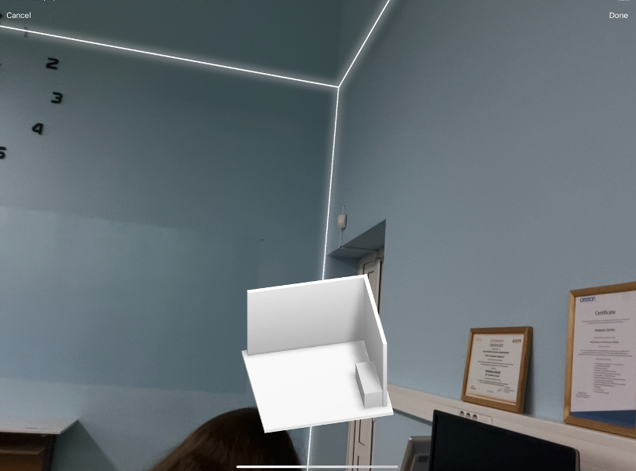
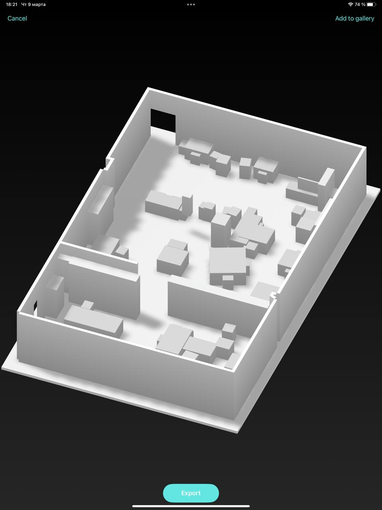
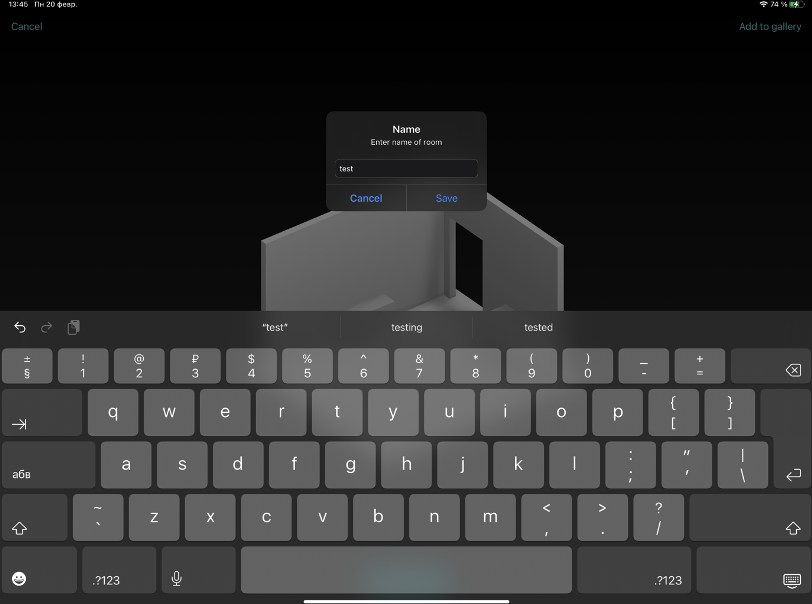

# 3DRoomPlanScanApp

 An application was developed to quickly create room layouts using LiDAR.

 The project is not finished.

#### Several images partially demonstrating the application:

1. Scanning

2. Result:

3. Saving:

After saving we can export our scan and open it in Blender. 
We can also view all scans in the app itself.